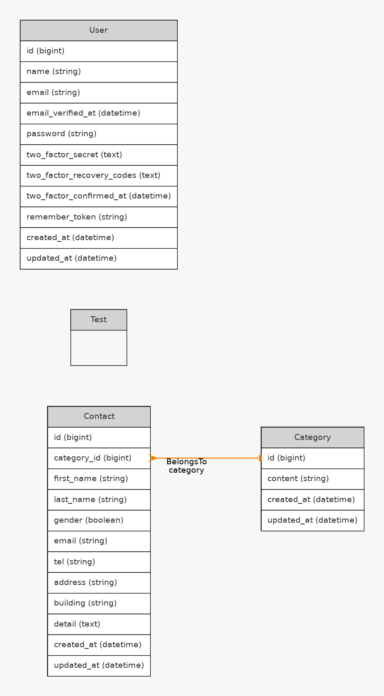

# お問い合わせフォーム

## 環境構築

## Dockerビルド
1. git clone: git@github.com:aya0517/contact-form.git
2. docker-compose up -d -build

## Laravel環境構築
1. docker compose up -d --build
2. cp src/.env.example src/.env
3. docker compose exec php bash
4. composer install
5. php artisan key:generate
6. php artisan migrate

## 使用技術
・PHP 8.0
・Laravel 10.0
・MySQL 8.0
・Nginx 1.21.1
・phpMyAdmin 5.2.2

## ER図

## URL
・開発環境: http://localhost
・phpMyAdmin: http://localhost:8080